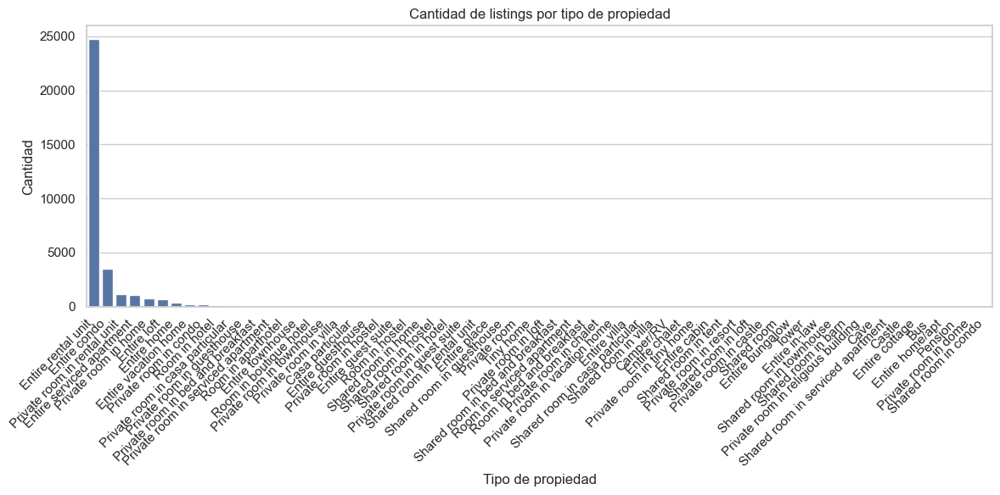
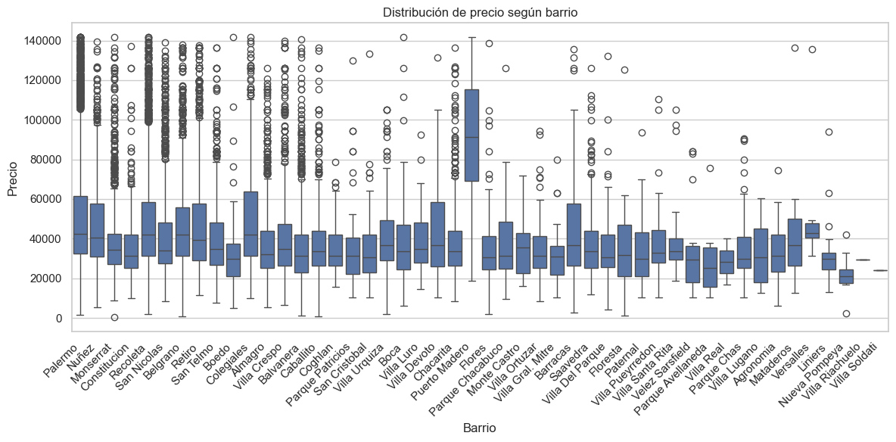
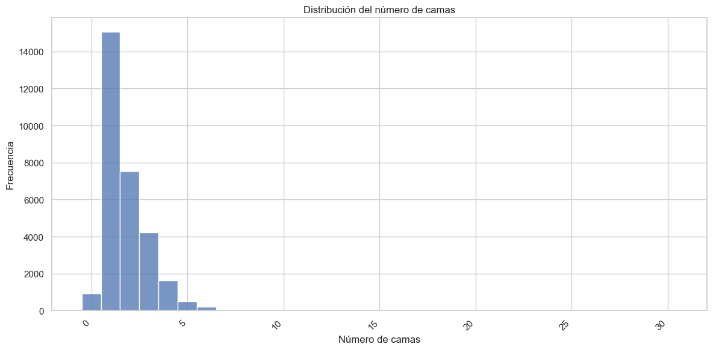
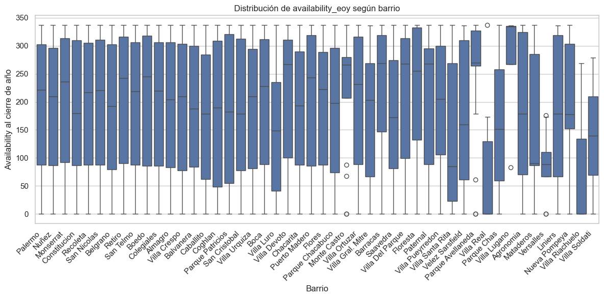
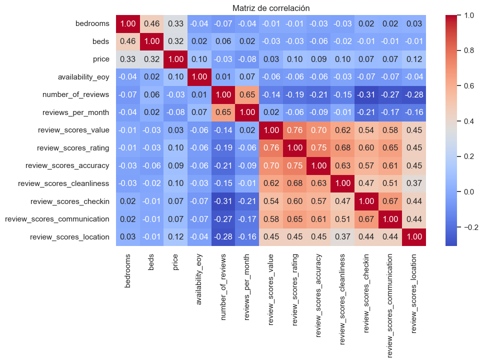

# Carrera de Especialización de Inteligencia Artificial (CEIA)

# Trabajos Práctico Número 1
### Grupo: 

          - Martín A. Brocca 
          - Agustín A. Lopez Fredes 
          - 
# Análisis Exploratorio de Datos del Dataset de AirBnB en Buenos Aires

Este repositorio contiene un análisis exploratorio de datos (EDA) realizado sobre un dataset público de AirBnB correspondiente a la ciudad de Buenos Aires. El objetivo de este análisis es obtener una comprensión inicial de los datos, identificar patrones, tendencias y posibles áreas de interés para futuros análisis o modelos predictivos.

## Contenido

1.  **Introducción**
2.  **Objetivos del Análisis**
3.  **Descripción del Dataset**
4.  **Metodología**
5.  **Hallazgos y Highlights**
    * 5.1. Distribución Geográfica de los Alojamientos
    * 5.2. Tipos de Propiedad y Habitaciones
    * 5.3. Precios y su Distribución
    * 5.4. Capacidad de Alojamiento (Huéspedes, Camas, Baños)
    * 5.5. Servicios (Amenities) Ofrecidos
    * 5.6. Reseñas y Calificaciones
    * 5.7. Disponibilidad de los Alojamientos
    * 5.8. Relaciones Clave entre Variables
6.  **Conclusiones**

---

## 1. Introducción

El análisis exploratorio de datos (EDA) es una fase crucial en cualquier proyecto de ciencia de datos, permitiéndonos sumergirnos en el conjunto de datos para descubrir patrones, detectar anomalías y probar hipótesis. En este trabajo, aplicamos el EDA a un dataset de AirBnB de Buenos Aires, una de las ciudades más vibrantes de Sudamérica, con el fin de entender mejor su oferta de alojamiento y las dinámicas del mercado turístico local.

## 2. Objetivos del Análisis

Los principales objetivos de este EDA fueron:

* **Comprender la distribución geográfica** de los alojamientos de AirBnB en la ciudad de Buenos Aires.
* **Identificar los tipos de propiedad y habitaciones** más prevalentes.
* **Analizar la distribución de precios** y explorar los factores que podrían influir en ellos.
* **Examinar la capacidad de los alojamientos** en términos de número de huéspedes, camas y baños.
* **Visualizar los servicios (amenities)** más frecuentemente ofrecidos por los anfitriones.
* **Evaluar la calidad de los alojamientos** a través de las reseñas y calificaciones.
* **Analizar la disponibilidad** de los alojamientos a lo largo del año.
* **Descubrir relaciones y correlaciones** entre las diferentes variables del dataset.

## 3. Descripción del Dataset

El dataset utilizado para este análisis fue obtenido de [Inside AirBnB](https://insideairbnb.com/get-the-data/), una iniciativa que provee datos públicos de AirBnB para fines de investigación. Se utilizó la información correspondiente a la ciudad de Buenos Aires. El dataset contiene una amplia variedad de columnas, incluyendo detalles sobre la propiedad, la ubicación, el anfitrión, los precios, las reseñas y la disponibilidad, con un total de 35.000 propiedades listadas y 78 características.

## 4. Metodología

El análisis se realizó utilizando el lenguaje de programación Python, apoyándose en las siguientes librerías principales:

* **Pandas:** Para la manipulación y el análisis de datos estructurados.
* **NumPy:** Para operaciones numéricas eficientes.
* **Matplotlib y Seaborn:** Para la creación de visualizaciones estáticas y estadísticas.
* **Geopandas y Shapely:** Para el manejo y visualización de datos geoespaciales.
* **Missingno:** Para la visualización de datos faltantes.

La metodología incluyó la carga inicial de datos, la inspección de la calidad de los datos (manejo de valores nulos y atípicos), el análisis univariado y bivariado de las variables, y la generación de diversas visualizaciones para comunicar los hallazgos.

## 5. Hallazgos y Highlights

### 5.1. Distribución Geográfica de los Alojamientos

La distribución de los alojamientos muestra una clara concentración en ciertas áreas de la ciudad, principalmente en barrios con alto atractivo turístico y buena conectividad.

**Highlight:** Se observa una mayor densidad de propiedades en los barrios céntricos y turísticos como Palermo, Recoleta y San Telmo, lo que indica un fuerte enfoque en el mercado turístico.

### 5.2. Tipos de Propiedad y Habitaciones

La oferta de AirBnB en Buenos Aires está dominada por ciertos tipos de propiedad y configuraciones de habitaciones.

**Highlight:** La mayoría de los listings corresponden a "Entire home/apt" (propiedad entera/apartamento), seguido de "Private room" (habitación privada), reflejando una preferencia por la privacidad.

### 5.3. Precios y su Distribución

Los precios de los alojamientos varían significativamente, influenciados por factores como el tipo de propiedad, la ubicación y la capacidad.

**Highlight:** Los precios presentan una distribución asimétrica, con una cola larga hacia valores más altos. Se identificaron barrios con precios promedio significativamente más elevados, como Recoleta y Puerto Madero, y una fuerte relación del precio con el barrio.

### 5.4. Capacidad de Alojamiento (Huéspedes, Camas, Baños)

La capacidad de los alojamientos se ajusta a diferentes necesidades de los viajeros.

**Highlight:** La mayoría de los alojamientos están diseñados para una o dos personas, con una o dos camas y un baño, lo que sugiere una oferta orientada a viajeros individuales o parejas. Las propiedades de menor tamaño (menor número de camas y habitaciones) presentan mayor ocupación.

### 5.5. Servicios (Amenities) Ofrecidos

Los servicios ofrecidos son un factor clave para la atracción de huéspedes.

**Highlight:** El Wi-Fi, la cocina y el aire acondicionado son los servicios más comunes, indicando su importancia para los huéspedes.

### 5.6. Reseñas y Calificaciones

La opinión de los huéspedes es crucial para la reputación de los alojamientos.

**Highlight:** La mayoría de los alojamientos tienen calificaciones altas, lo que sugiere una buena calidad general en la oferta de AirBnB en la ciudad. No se observó una relación significativa entre el precio de los listings y la cantidad o valor de las reviews.

### 5.7. Disponibilidad de los Alojamientos

La disponibilidad de las propiedades varía a lo largo del año.

**Highlight:** La disponibilidad tiende a ser menor en los meses de verano (diciembre, enero, febrero), lo que sugiere una mayor afluencia de turistas internacionales en esa época. Desde el punto de vista del negocio, esto podría justificar, por ejemplo, una mayor publicidad en los meses previos a la temporada de verano, o realizar el mantenimiento de las propiedades fuera de estos meses de mayor ocupación. No se apreciaron diferencias significativas en la disponibilidad entre barrios.

### 5.8. Relaciones Clave entre Variables

El análisis de correlaciones reveló algunas relaciones interesantes entre las variables.

**Highlight:** Los precios tienen relación con la ocupación, por lo que una estrategia de promociones puede incrementar el porcentaje de ocupación de la propiedad. Los precios de las habitaciones compartidas son más bajos que los de habitaciones privadas o propiedades enteras, como era de esperar.

## 6. Conclusiones

Este análisis exploratorio nos ha permitido obtener una visión integral del mercado de AirBnB en Buenos Aires. Hemos identificado las áreas de mayor concentración de alojamientos, los tipos de propiedad y habitaciones predominantes, y la influencia de la ubicación y las características en los precios. Además, se destacó la estacionalidad en la disponibilidad y la importancia de ciertos servicios y la relación con la ocupación.

