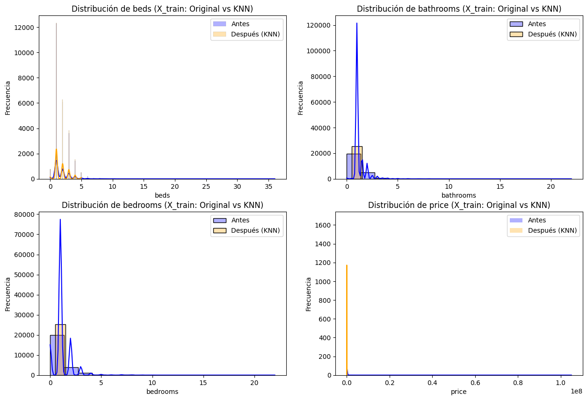
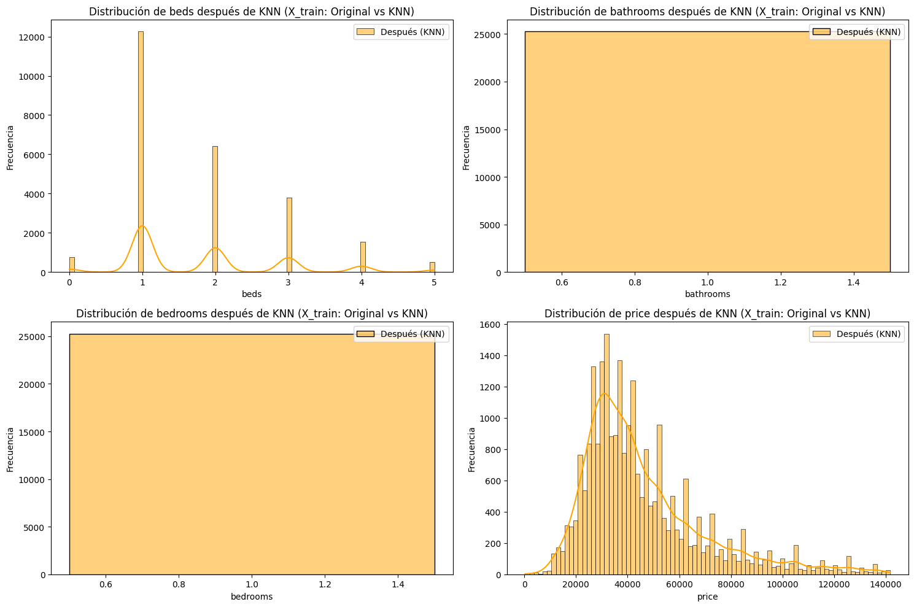
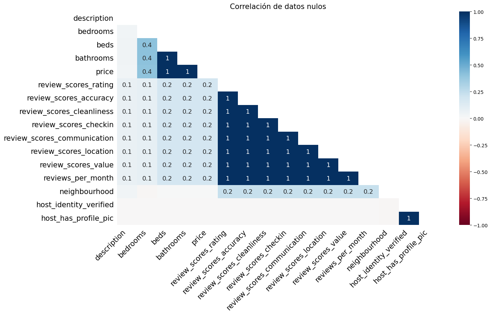
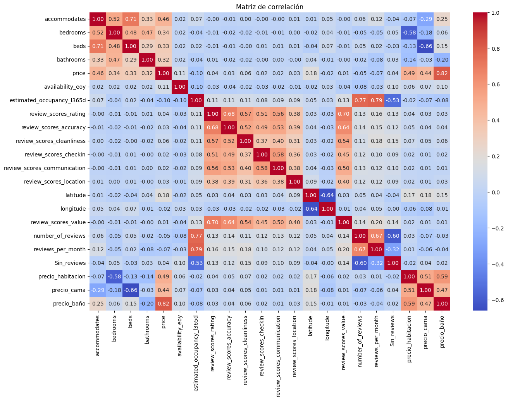
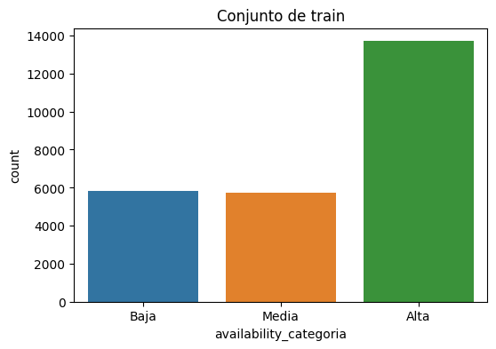
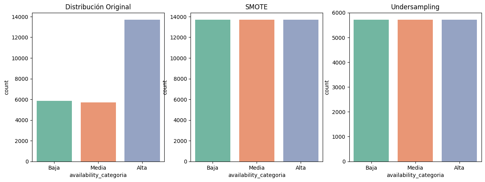

# Trabajo Práctico Nº 2 — Análisis de datos - Trabajo práctico integrador

### 👥 Grupo: 

          - Martín A. Brocca 
          - Agustín A. Lopez Fredes 

---

## 🎯 Objetivos

- Evaluar la distribución de clases antes y después del balanceo.
- Aplicar PCA como herramienta de análisis exploratorio.
- Utilizar PCA para selección de variables.
- Usar PCA como técnica de reducción de dimensionalidad.

---

## 📂 Contenido del trabajo

### 1. Análisis exploratorio y distribución de clases

Se analizaron las clases del conjunto de entrenamiento original, observando su distribución inicial. Luego se aplicaron técnicas de balanceo para corregir los desbalances.

**Distribución original de clases:**

**Distribución tras el balanceo:**

**Análisis de nulos** 

---

### 2. Correlación de variables

- La variable bedrooms tiene correlación con beds, bathrooms, y un poco menor con price, que ya no tenían nulos, por lo que podemos utilizar una regresión para imputarla
- Las variables de reviews tienen alta correlación entre sí, pero como vimos sus faltantes coincidían al 100%, por lo que no es posible usarlas para imputar. 
- Las alternivas a evaluar en la notebook son:
    - Eliminar las filas, pero representan aprox 16% del dataset
    - Eliminar las columnas, perdiendo toda la información de reviews
    - Imputar con la moda, pero esto cambiaría drásticamente la distribución
    - Imputar con el resto de las variables, lo que implica usar variables con correlación baja
    - Codificarla con un valor que indique la ausencia, por ejemplo -1, pero los modelos podrían confundir este menor como un valor más bajo de review

---

### 3. Análisis de desbalance

 Se observa un fuerte desbalance en la clase Alta, que tiene más del doble de datos que las demás. Para corregirlo se consideraron:

  - SMOTE: genera datos sintéticos para igualar las clases hacia arriba. Sin embargo, en las clases Baja y Media, más de la mitad serían datos artificiales, lo que puede afectar el entrenamiento.
  - Random Undersampling: reduce la clase mayoritaria (Alta) seleccionando una muestra aleatoria, sin generar datos sintéticos, pero descartando información.
  - También existen métodos que asignan pesos por clase para compensar el desbalance sin modificar los datos, pero esta opción no se explora ya que el foco está en el preprocesamiento.
  

---

### 4. Test estadísticos
* **Anova**
  - Se aplicó ANOVA para identificar qué variables numéricas explican mejor la variabilidad entre las categorías de disponibilidad.
  - Las variables más relevantes según el valor F fueron:
    - price (F = 254.5): principal variable explicativa.
    - Sin_reviews (F = 167.2): importante relación entre ausencia de reseñas y disponibilidad.
    - precio_baño (F = 150.6): el costo por baño muestra una fuerte asociación.
  - Otras variables destacadas:
    - estimated_occupancy_l365d, accommodates y precio_cama también muestran buena capacidad discriminativa.
  - Las variables de puntaje del host (review_scores_*) aportan moderadamente a la diferenciación entre categorías.
  - Variables como latitude, longitude, beds, reviews_per_month, cleanliness, location, etc., no alcanzaron umbrales significativos y fueron descartadas.

* **Información mutua**
  - Se utilizó Información Mutua para medir la dependencia no lineal entre variables numéricas y las categorías de disponibilidad.
  - Las variables más informativas fueron:
    - estimated_occupancy_l365d (0.0799): mayor poder explicativo respecto a la variable objetivo.
    - longitude y precio_baño también aportan información significativa.
    - price, aunque fue la más relevante en ANOVA, aquí muestra una dependencia más moderada (0.0592), reflejando diferencias entre métodos.
  - Otras variables relevantes:
    - latitude, precio_cama, number_of_reviews, y reviews_per_month también presentan asociación útil con la variable objetivo.
  - Variables como precio_habitacion, Sin_reviews, y accommodates aportan menor cantidad de información, pero no son despreciables.
  - Algunas variables, como review_scores_rating, tienen muy baja información mutua, lo que sugiere escasa relación con la disponibilidad.

---

## 🖼️ Otros recursos visuales

- Matriz de correlación de features: `./images/tp2_corr_matrix.png`
- Visualización del conjunto de entrenamiento: `./images/conjunto_de_train.png`
- Comparaciones visuales de distribuciones antes y después del balanceo:
  - `./images/distribuciones_columnas.png`
  - `./images/ditribuciones_original_vs_balanceadas.png`

---

## 📁 Estructura del repositorio

